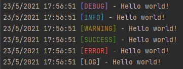

# Pro console.log()

> A module that allows writing logs to the console or to a file powerfully.
 
## Get Started
`npm i @dariodigulio/pro-log-js`

## Basic Usage

```
import { ProLog } from "@dariodigulio/pro-log-js";

ProLog.log('Hello, world', 's');
ProLog.log('Log message');
Prolog.success('Success message);
Prolog.error('Error message');
Prolog.warning('Warning message');
Prolog.debug('Debug message');
```

## More Usages

```
import { ProLog } from "@dariodigulio/pro-log-js";

const MyLogger = new ProLog('./log.log');
MyLogger.log('Logger in file');
MyLogger.log('Log message');
MyLogger.success('Success message);
MyLogger.error('Error message');
MyLogger.warning('Warning message');
MyLogger.debug('Debug message');
```

## Params

 * Text: String
* Status:
    * `s|S`: [SUCCESS]
    * `w|W`: [WARNING]
    * `e|E`: [ERROR]
    * `i|I`: [INFO]
    * `d|D`: [DEBUG]  
    * default: [LOG]
    
## Result 

